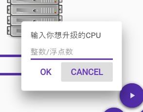
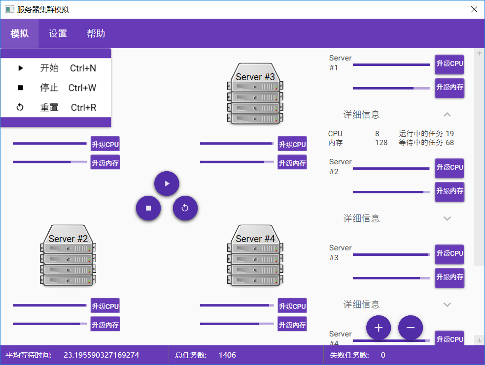
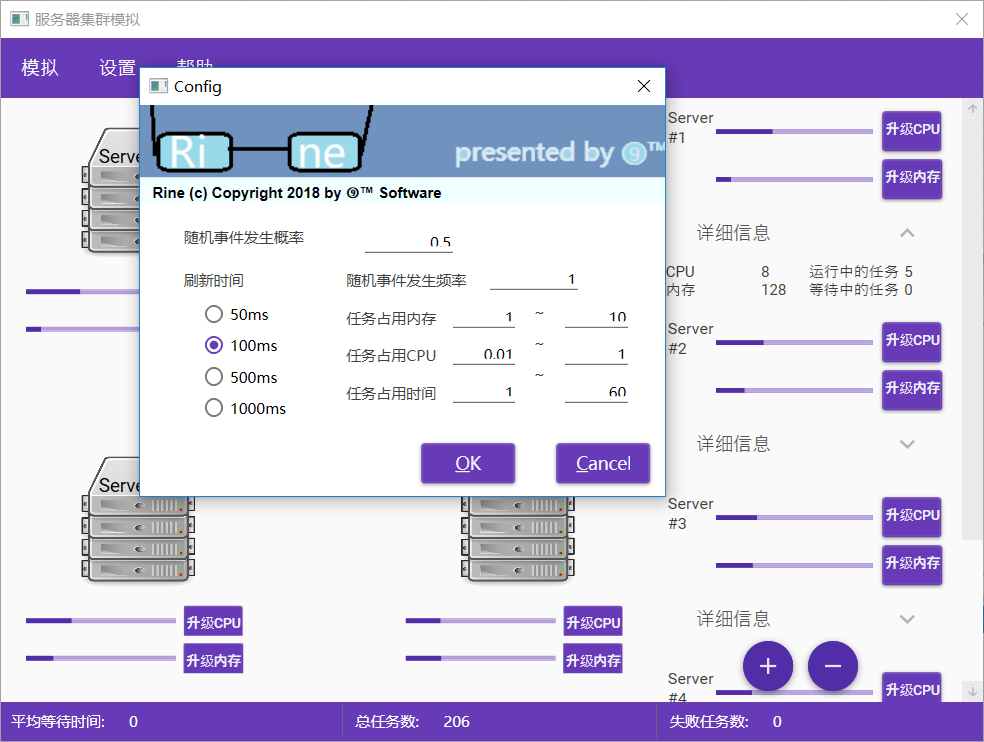
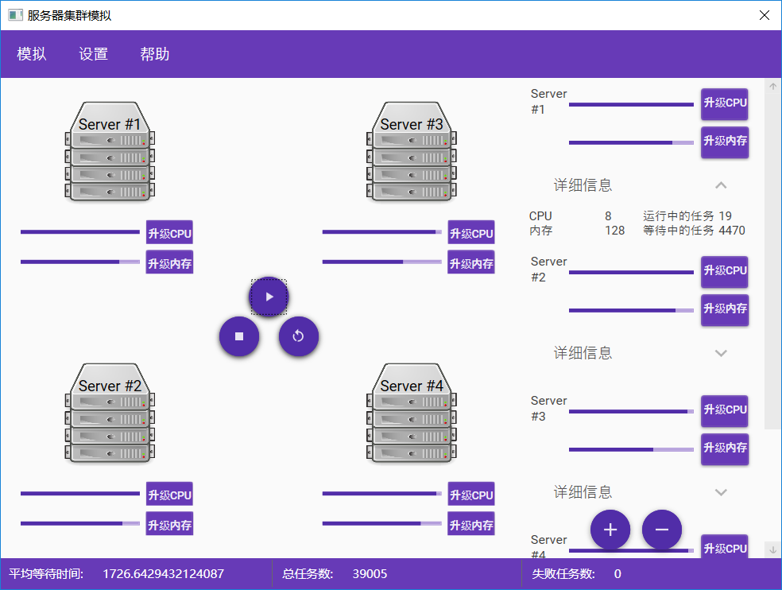

# 实验2—离散模拟

- 姓名：魏剑宇
- 学号：PB17111586

---

## 实验要求

1. 实现基本功能，假设合理且符合现实生活。
2. 模块化程序设计（程序的分层结构、函数的功能和接口）
3. 程序鲁棒性

4. 时空效率

5. 图形化界面

6. 程序人性化（代码易读，输入输出易读易于理解，使用方便，操作简单便捷）

## 实验内容

**实验题目**：集群模拟

**内容描述**：

1. 有一个由多个服务器节点组成的**[集群](https://en.wikipedia.org/wiki/Computer_cluster)**
2. 这个集群每个单位时间内会收到大量的任务请求
3. 每个任务拥有属性**Memory cost**、**Cpu cost**、**Time cost**。每个属性随机分布在一定范围内。
4. 集群中的每个服务器有一定的cpu性能和内存。
5. - 如果一个服务器的当前剩余资源超过了任务的消耗，任务会立被分配到服务器的线程池并被处理。
   - 如果超过了服务器的总资源，任务会失败。
   - 否则任务会在队列中等待被处理。
6. 集群中有一个负载管理器，采用一种贪婪的算法在服务期间分配任务来尽力达到平衡。
7. 任务的消耗和服务器的数量及cpu、内存是可设定的。

## 实验关键代码描述

代码通过c#实现，基于.NET Framework 4.7.1。基于[WPF(Windows Presentation Foundation)](https://docs.microsoft.com/en-us/dotnet/framework/wpf/)实现GUI，采用MVVM模型，GUI样式采用[Material Design](https://github.com/MaterialDesignInXAML/)。代码位于[我的数据结构GitHub Repo](https://github.com/kaleid-liner/DataStructure)。

### 后端

下面列举了后端代码中涉及的**主要**的类及类的**关键**属性、方法和private field。

|     Class     |              field               |                           Property                           |                          Method                          |  Description   |
| :-----------: | :------------------------------: | :----------------------------------------------------------: | :------------------------------------------------------: | :------------: |
|    Server     | 线程池（数组）、任务队列（队列） |               Cpu、Memory、Cpu消耗、Memory消耗               |        分配任务、分配任务（Lazy模式）、升级、刷新        | 表示服务器的类 |
| LoadBalancer  |  Servers（可分配任务的服务器）   |                             N/A                              |     增加服务器、删除服务器、**分配任务**（贪婪算法）     |   负载管理器   |
|   Simulator   |       RNG（随机数发生器）        |      每秒产生任务数、总任务数、失败任务数、平均等待时间      | Reset（清除当前所有状态）、Simulate（进行一周期的模拟）  |     模拟器     |
|     Task      |               N/A                | 时间消耗、Cpu消耗、Memory消耗、剩余时间、是否完成（皆为readonly property） |            WorkFor（表示任务进行了一段时间）             |  表示任务的类  |
| TaskGenerator |               RNG                |              产生任务的Cpu、Memory、Time的范围               | Config（设置产生任务的消耗）、NextTask（产生下一个任务） |  产生任务的类  |

其中，为了保证效率，TaskGenerator使用了一种贪婪的算法。即优先在空闲多的服务器分配、当所有服务器无法容纳进入处理能力最强的服务器的队列、否则失败。在模拟过程中，由所有服务器负载非常均衡可知此方案较为成功。

代码中遵循了大部分工程化设计中的Best Practice，可读性较好。体现了面向对象的基本原则。

模拟的主要流程的借助于一个计时器来实现。该计时器的类为`DispatcherTimer`。每隔一段时间引发一个事件`event`，在一个线程上执行Callback函数，从而来完成模拟中的主要事件。

### 前端

代码中`SimulatorViewModel`用于前后端的交互。通过数据绑定和Command实现。

前端代码中实现了两个控件。其中一个较重要的是`CpuMemoryControl`。它实现了为服务器升级的功能。

```xaml
<Grid>
        <Grid.RowDefinitions>
            <RowDefinition Height="1*"/>
            <RowDefinition Height="1*"/>
        </Grid.RowDefinitions>
        <Grid.ColumnDefinitions>
            <ColumnDefinition Width="2*"/>
            <ColumnDefinition Width="1*"/>
        </Grid.ColumnDefinitions>
        <ProgressBar Grid.Row="0" x:Name="cpuBar" Minimum="0" Maximum="{Binding Cpu, Mode=OneWay}" Value="{Binding CpuUsage, Mode=OneWay}"/>
        <ProgressBar Grid.Row="1" x:Name="memoryBar" Minimum="0" Maximum="{Binding Memory, Mode=OneWay}" Value="{Binding MemoryUsage, Mode=OneWay}"/>
        <materialDesign:DialogHost Grid.Row="0" Grid.Column="1" HorizontalAlignment="Center" VerticalAlignment="Center"
                                   DialogClosing="CpuDialogClosing" >
            <Button x:Name="cpuButton"  Grid.Row="1" Grid.Column="1" Content="升级CPU" Padding="2,0,2,4" FontSize="11" 
                    Command="materialDesign:DialogHost.OpenDialogCommand" Margin="3"/>
            <materialDesign:DialogHost.DialogContent>
                <StackPanel Margin="15">
                    <TextBlock Text="输入你想升级的CPU"/>
                    <TextBox x:Name="cpuBox" materialDesign:HintAssist.Hint="整数/浮点数" Margin="0,8,0,0"/>
                    <StackPanel Orientation="Horizontal" HorizontalAlignment="Right" >
                        <Button IsDefault="True" Style="{StaticResource MaterialDesignFlatButton}" Content="OK"
                                Command="materialDesign:DialogHost.CloseDialogCommand" Margin="0,4,0,0">
                            <Button.CommandParameter>
                                <sys:Boolean>True</sys:Boolean>
                            </Button.CommandParameter>
                        </Button>
                        <Button IsCancel="True" Style="{StaticResource MaterialDesignFlatButton}" Content="CANCEL"
                                Command="materialDesign:DialogHost.CloseDialogCommand" Margin="0,4,0,0">
                            <Button.CommandParameter>
                                <sys:Boolean>False</sys:Boolean>
                            </Button.CommandParameter>
                        </Button>
                    </StackPanel>
                </StackPanel>
            </materialDesign:DialogHost.DialogContent>
        </materialDesign:DialogHost>
        <materialDesign:DialogHost Grid.Row="2" Grid.Column="1" HorizontalAlignment="Center" VerticalAlignment="Center"
                                   DialogClosing="MemoryDialogClosing">
            <Button x:Name="memoryButton"  Grid.Row="1" Grid.Column="1" Content="升级内存" Padding="2,0,2,4" FontSize="11" Margin="3"
                    Command="materialDesign:DialogHost.OpenDialogCommand"/>
            <materialDesign:DialogHost.DialogContent>
                <StackPanel Margin="15">
                    <TextBlock Text="输入你想升级的内存"/>
                    <TextBox x:Name="memoryBox" materialDesign:HintAssist.Hint="整数/浮点数 (GB)"/>
                    <StackPanel Orientation="Horizontal" HorizontalAlignment="Right">
                        <Button IsDefault="True" Style="{StaticResource MaterialDesignFlatButton}" Content="OK"
                                Command="materialDesign:DialogHost.CloseDialogCommand">
                            <Button.CommandParameter>
                                <sys:Boolean>True</sys:Boolean>
                            </Button.CommandParameter>
                        </Button>
                        <Button IsCancel="True" Style="{StaticResource MaterialDesignFlatButton}" Content="CANCEL"
                                Command="materialDesign:DialogHost.CloseDialogCommand">
                            <Button.CommandParameter>
                                <sys:Boolean>False</sys:Boolean>
                            </Button.CommandParameter>
                        </Button>
                    </StackPanel>
                </StackPanel>
            </materialDesign:DialogHost.DialogContent>
        </materialDesign:DialogHost>
    </Grid>
```

实现的效果大致为：

前端后端通过MVVM进行了分离，减小了诸如线程死锁等bug发生概率的同时，保证了没有duplicate code从而减少了代码量。

且由于较良好的xaml书写习惯，即在Mardown Language中进行语义化而非样式化的设计，不仅使代码更清晰，在应用样式（Style、template）时，产生的较好的效果，最后应用了Material Design In XAML后的GUI较美观。

### Relay Command

代码中在进行前后端交互的过程中，部分交互通过`RelayCommand`实现。这个类实现了接口`ICommand`，是MVVM设计模式推荐的一个类。它能将一个方法委托给另一个类来完成。

在代码中，我将MainWindows中添加服务器等方法委托给ViewModel来实现。因为该视图模型的private field中存有集群。

实现效果大致如下





当任务产生频率达到一定量，而服务器未经过升级、服务器数量不足时，服务器中会有任务等待，平均等待时间会上升。如下图所示。

当任务的消耗超过一定值，会产生失败的任务。

## 实验小结

- 此实验总体较简单，通过C#能较轻松的完成。
- 通过此实验，我进一步熟练了WPF上GUI的编写和MVVM模型。
- 学会了如何设计一个场景。