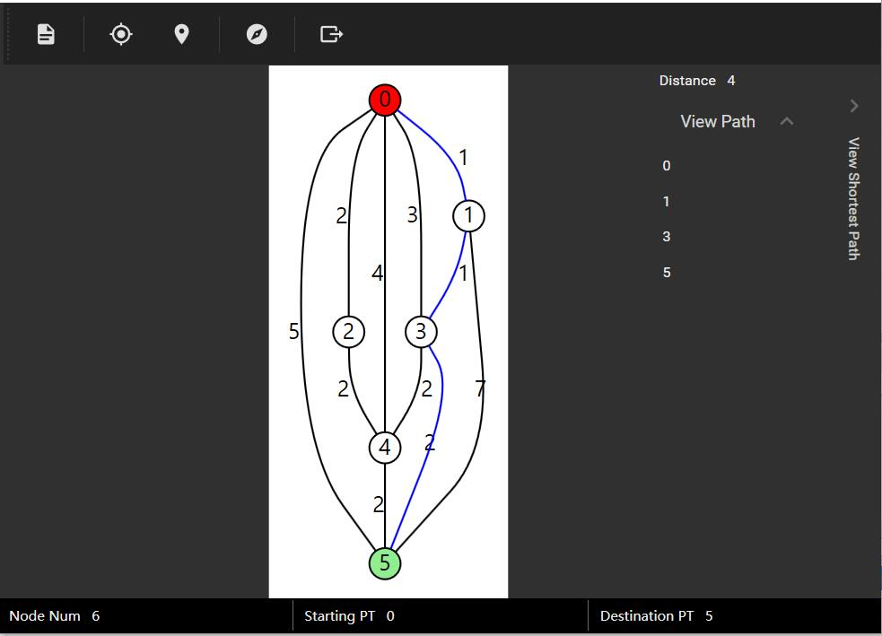
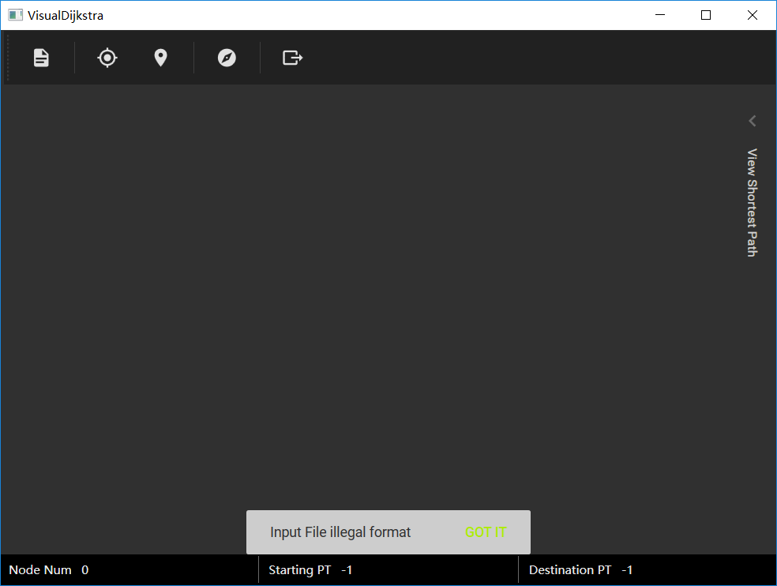

# VisualDijkstra 实验报告

- **姓名**：魏剑宇
- **学号**：PB17111586

---

## 实验要求

1. 假设路径双向通行，用负数表示无法通行的路径。
2. 使用一定格式进行输入输出，可自选。
3. 实现GUI，可对Dijkstra算法的寻路过程进行可视化。

## 实验内容

**实验题目**：最短路径

**内容描述**：

1. 实现Dijkstra算法进行最短路径的查找。Dijkstra是一个十分简单易实现的算法。
2. 在实现的过程中，我使用了最小堆对书中的Dijkstra算法进行优化。并使用邻接表存储图。这样，Dijkstra的时间复杂度达到$O(E+V\lg V)$.
3. 实现GUI后，通过一个`Load Graph`的`Button`来进行输入，并在页面中设定起始点、终止点，即可显示最短路径。

实现效果大致如下



## 实验关键代码描述

代码通过c#实现，基于.NET Framework 4.7.1。基于[WPF(Windows Presentation Foundation)](https://docs.microsoft.com/en-us/dotnet/framework/wpf/)实现GUI，GUI样式采用[Material Design](https://github.com/MaterialDesignInXAML/)。绘图使用[MSAGL](https://github.com/Microsoft/automatic-graph-layout)。代码位于[我的数据结构GitHub Repo](https://github.com/kaleid-liner/DataStructure/tree/master/VisualDijkstra)。

由于使用的绘图库较陈旧，应属于Winform的库，不支持MVVM模型，故本次实验的GUI未采用MVVM。

### Dijkstra算法

在实现Dijkstra算法时，我使用了**最小堆的数据结构进行优化**。大致思路与书中相同，但在找当前离源点最近的点时，若每次都线性查找，是浪费时间的。可以使用最小堆，这样查找的时间复杂度为$O(\lg n)$。

代码中，我定义了一个很简单的表示边的类

```csharp
public class Edge
{
    public int To { get; set; }
    public int Cost { get; set; }
}
```

这样，图可以表示为`List<Edge>[] graph`。

用于求解的静态类如下所示

```csharp
static public class Dijkstra
{
    /// <summary>
    /// find shortest path from src to dst in graph using priority queue for      optimization
    /// </summary>
    /// <param name="graph">input graph</param>
    /// <param name="src">initial node</param>
    /// <param name="dst">destination node</param>
    /// <returns>tuple of the shortest path found and total length</returns>
    public static Tuple<int[], int> Solve(List<Edge>[] graph, int src, int dst)
    {
        int length = graph.Length;
        var queue = new SimplePriorityQueue<ValueTuple<int, int>, int>();
        int[] dist = new int[length];
        int[] prev = new int[length];
        for (int i = 0; i < dist.Length; i++)
            dist[i] = int.MaxValue;
        dist[src] = 0;
        prev[src] = src;
        queue.Enqueue((src, 0), 0);
        while (queue.Count != 0)
        {
            var tuple = queue.Dequeue();
            int node = tuple.Item1;
            int distance = tuple.Item2;
            if (dist[node] < distance) continue;
            dist[node] = distance;
            foreach (var edge in graph[node])
            {
                if (edge.Cost + dist[node] < dist[edge.To])
                {
                    dist[edge.To] = edge.Cost + dist[node];
                    queue.Enqueue((edge.To, dist[edge.To]), dist[edge.To]);
                    prev[edge.To] = node;
                }
            }
        }
        int[] path = new int[length];
        int cnt = 0, cur = dst;
        while (cur != src)
        {
            path[cnt++] = cur;
            cur = prev[cur];
        }
        path[cnt++] = src;
        int[] ret = new int[cnt];
        Array.Copy(path, ret, cnt);
        Array.Reverse(ret);
        return new Tuple<int[], int>(ret, dist[dst]);
    }
}
```

接口已经很明显了。这里，我大致描述一下求解过程。首先将原点入列，当最小堆未空时，得到当前堆最上方的节点，即（可能是）当前离源点最近的顶，这个过程是$O(1)$的。找到后，从此顶出发，更新其它顶的距离，并依次入列。

当堆空后，最后得到的即为要求的顶。同时，在找最短距离时，使用前驱`prev`存每个顶的前驱，这样，从终点出发，即可还原这条路径。

###  图形界面

#### 读取输入

输入为一个具有特定格式的文本文件。文件中存储着一个邻接矩阵。读取文件，从文件构造出整个图，值得一提的是，C#的输入处理相对C++麻烦一点。为保证程序的鲁棒性和用户友好，在文件格式不正确时，会提供给用户信息，如下

```csharp
tipsSnackBar.MessageQueue.Enqueue("Input File illegal format", "GOT IT", () => { });
```

效果如下图



#### 界面控件

界面上方的`toolbar`，功能分别为Load Graph，Set as Starting Point，Set as Destination，Find Shortest Path，Export Result as Text。将指针移动到对应icon上，会显示如上的tooltip。其代码如下

```xaml
<ToolBar Style="{StaticResource MaterialDesignToolBar}" Grid.ColumnSpan="2">
    <Button ToolTip="Load a Graph" Click="LoadGraph_Click">
        <materialDesign:PackIcon Kind="FileDocument"/>
    </Button>
    <Separator/>
    <Button ToolTip="Set as Starting Point" Click="SetStart_Click">
        <materialDesign:PackIcon Kind="MyLocation"/>
    </Button>
    <Button ToolTip="Set as Destination" Click="SetDestination_Click">
        <materialDesign:PackIcon Kind="Location"/>
    </Button>
    <Separator/>
    <Button ToolTip="Find Shortest Path" Click="Dijkstra_Click">
        <materialDesign:PackIcon Kind="Explore"/>
    </Button>
    <Separator/>
    <Button ToolTip="Export Result as Text" Click="ExportResult_Click">
        <materialDesign:PackIcon Kind="Export"/>
    </Button>
</ToolBar
```

其中，ExportResult是将结果的标准格式输出复制到剪贴板中。

下面说明一下找最短路径部分的前端代码，如下，

```csharp
private void Dijkstra_Click(object sender, RoutedEventArgs e)
{
    var viewModel = DataContext as DijkstraViewModel;
    var path = viewModel.Path;
    if (path != null)
    {
        for (int i = 0; i < path.Length - 1; i++)
        {
            edges[path[i]][path[i + 1]].Attr.Color = Microsoft.Msagl.Drawing.Color.Black;
        }
    }
    if (viewModel.Solve())
    {
        path = viewModel.Path;
        for (int i = 0; i < path.Length - 1; i++)
        {
            edges[path[i]][path[i + 1]].Attr.Color = Microsoft.Msagl.Drawing.Color.Blue;
        }
    }
}
```

viewModel内部调用solve求解最短路径，并需要对边进行染色。即将原来染为蓝色的边返回黑色，新找到的路径染为蓝色。

## 实验小结

- Dijkstra实现起来较容易，经过最小堆优化后是一个高效的最短路径查找算法。虽然其无法用于有负权边的图。
- 使用一些进行Graph Layout的库，例如GraphViz，以及我所使用的msagl，能够简单地绘制出复杂的图。
- 使用C#开发Windows上的图形应用程序是一件非常轻松愉快的事情。